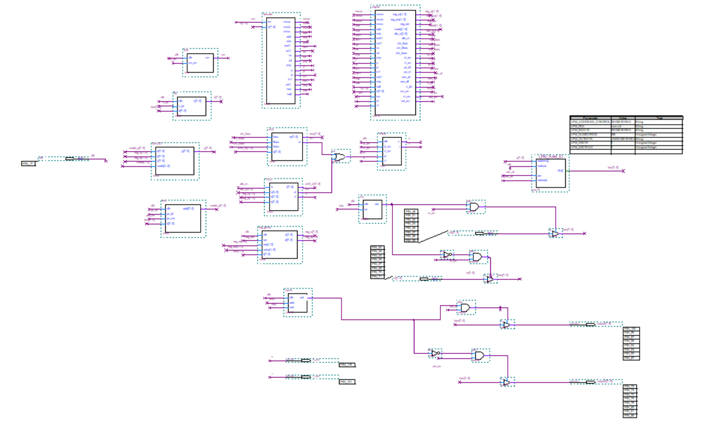
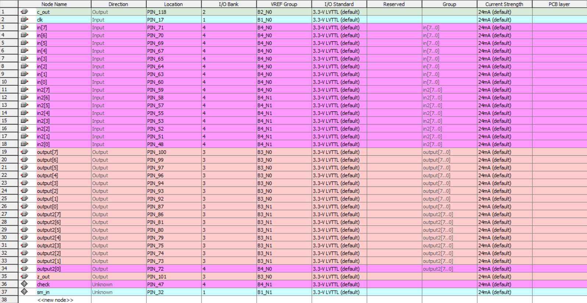

# 基于Verilog的简易CPU设计

该项目是笔者大二上学期电路电子学的课程大设计。该课程我愿称之为所有课程中最硬核的课程，该项目也是我所有课程设计中工程量最大、花费时间最多、沉浸感最深的一个项目。笔者的大设计取得了满分，该课程的总分也是全院的第一名。话不多说，简单介绍一下该项目。

整个CPU由13部件组成，包括5个组合部件，6个时序部件，2个输出输出部件，所有部件用Verilog语言实现。

关于各组合部件和时序部件的介绍见README文件目录下的各PDF。

经软件仿真和硬件测试，该简易CPU能够按照预期运行特定的指令集。

例如如下测试代码能够按照预期运行（相关测试视频见：[基于Verilog的简易CPU设计](https://www.bilibili.com/video/BV1MP41147MG/)）：

CPU组装图：

引脚配置图：

