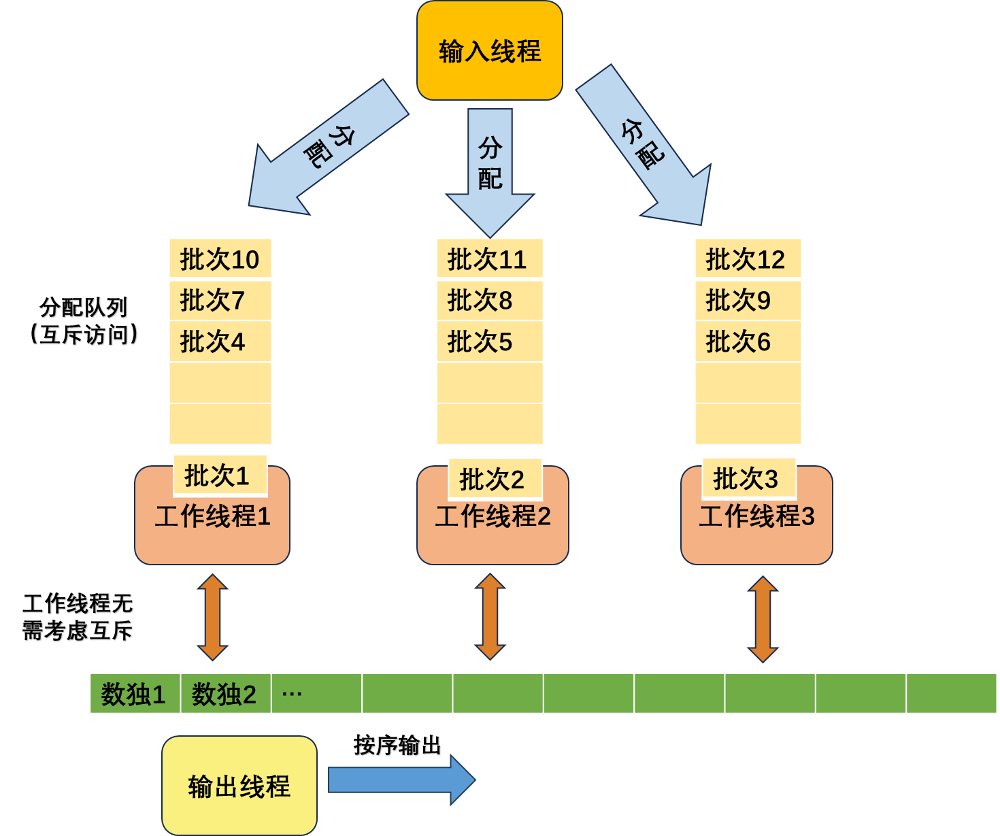

# 并行算法设计——多处理器解数独游戏

目的：实现一个接近**线性加速比**的多处理器解数独的并行算法。

**问题限制：**

1.输入规模可能非常大，可使用的内存有限。

2.处理器数量比较大（可能多于40），需要充分利用这些处理器

3.输入的数独被解出来后，必须按顺序输出

4.数独的解一定存在，并且唯一

**数据结构**：循环双端队列（存储数独）、队列（派发工作）

# 0.亮点

（1）使用标记位表示了同一块存储空间的三种意义，重复利用存储空间

（2）使用循环双端队列，不论提供的内存大小是多少，均能灵活应对

（3）通过巧妙的算法设计，使得工作线程无需考虑临界区的互斥问题，可以满载运行解数独代码，实现近似线性的加速比

（4）每个工作线程具有独立的工作队列，细粒度的互斥使得工作线程取任务时发送互斥的概率极小，进一步提升工作线程的效率。

## 1.数据组织方式

使用循环双端队列存储数独，并使用两个标记位标记数据的含义。

（1）打印位为1表示该数独的结果已经被打印过，因此该内存被释放，此内存空闲。

（2）打印位为0，解出位为1表示该处存放的是已经解出来的数独结果，可以被打印。

（3）打印位为0，解出位为0表示该处存放的是未解出的数独，可以被配发给工作线程解数独。

## 2.线程种类及分工

一共有3种线程，分别是输入线程、工作线程和输出线程。

### 输入线程

（1）每次读取一个数独，检查双端队列的队尾是否有空闲的空间（检查打印标记是否为1）

（2）如果有空闲空间，则将该数独存储进去，并将打印标记设置为0，解出标记设置为0，该数独进入待分配状态，进入（4）

（3）如果没有空闲空间，睡眠10ms，然后再次检查是否有空闲空间，如果有，进入（2），否则再次执行（3）

（4）当待分配的数独达到阈值（batch）时，将数独分配给最空闲的一个工作线程（仅将该批次在数组中的下标和该批次的长度分配给数组，节约时间和空间），并将该工作线程唤醒。如果未结束，回到（1）重复执行

（5）输入结束后，将当前剩余的所有待分配数独分配给一个工作线程

### 工作线程

（1）从分配队列中读取一个批次，并按顺序解出该批次数独的答案，将被解出的数独打印位设置为1，将解出后的数独结果存储在解出前的存储位置，充分利用存储空间

（2）完成该批次的任务后再次取出下一批次，如果分配队列中不存在下一批次，则进入休眠

### 输出线程

（1）从双端队列的首部开始逐一检测当前数独是否已经计算完毕，是否可打印

（2）若打印位为0且解出位为1，则打印当前数独，并将打印位设置为1。否则进入（3）

（3）睡眠10ms后进入（2）

### 算法示意图

